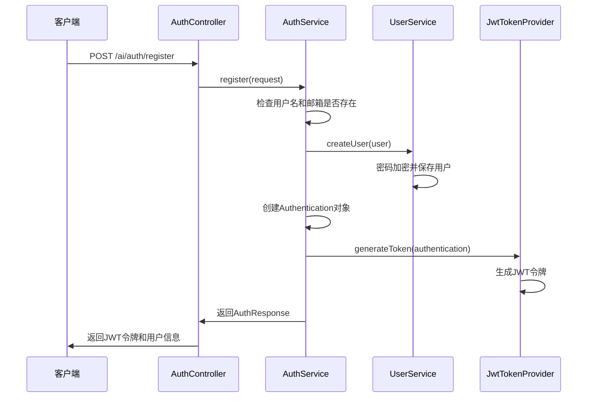
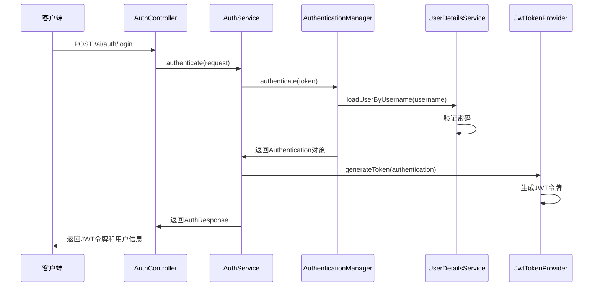
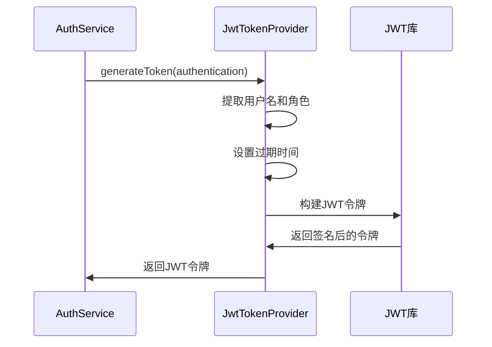
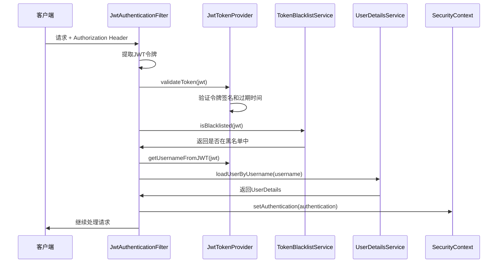
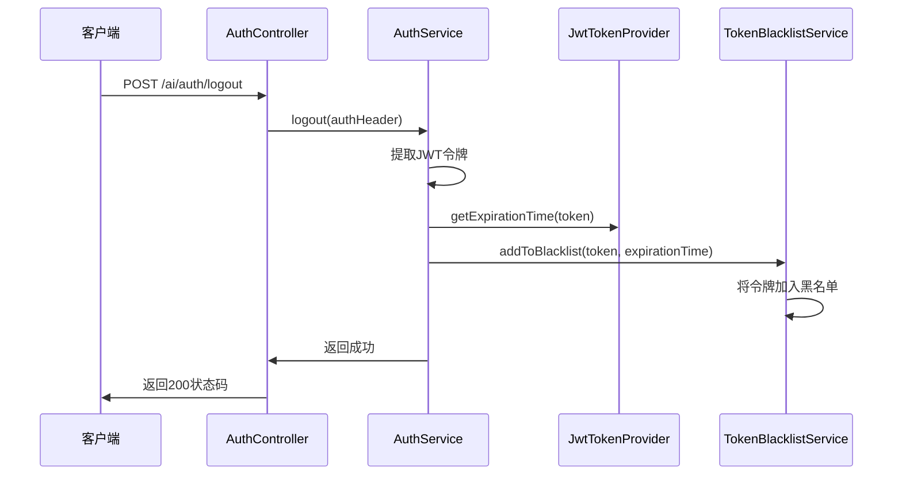

# Spring Security + JWT 工作模式和流程分析

## 项目概述

本项目是一个基于Spring Boot的聊天机器人后端系统，采用Spring Security + JWT实现身份认证和授权。系统支持用户注册、登录、登出，以及基于角色的访问控制。

## 核心组件架构

### 1. 安全配置层 (SecurityConfig)
- **位置**: `com.example.chatbot.config.SecurityConfig`
- **作用**: 配置Spring Security的安全策略、CORS、JWT过滤器等

### 2. JWT相关组件
- **JwtTokenProvider**: JWT令牌的生成、验证、解析
- **JwtService**: JWT服务的封装（项目中存在两个JWT服务类）
- **JwtAuthenticationFilter**: JWT认证过滤器

### 3. 用户认证组件
- **UserDetailsServiceImpl**: 实现Spring Security的UserDetailsService接口
- **AuthService**: 认证服务接口
- **AuthServiceImpl**: 认证服务实现

### 4. 令牌黑名单
- **TokenBlacklistService**: 令牌黑名单服务接口
- **TokenBlacklistServiceImpl**: 令牌黑名单服务实现

## 详细工作流程

### 1. 用户注册流程



**关键代码**:
```java
// AuthServiceImpl.java - register方法
@Override
public AuthResponse register(AuthRequest request) {
    // 1. 检查用户名和邮箱是否已存在
    if (userMapper.existsByUsername(request.getUsername()) > 0) {
        throw new BusinessException(ErrorCode.USERNAME_ALREADY_EXISTS);
    }
    
    // 2. 创建用户并设置默认角色
    User user = new User();
    user.setUsername(request.getUsername());
    user.setPassword(request.getPassword());
    user.setEmail(request.getEmail());
    user.setRoles(Set.of(UserRole.ROLE_USER));
    
    // 3. 保存用户
    userService.createUser(user);
    
    // 4. 生成JWT令牌
    Authentication authentication = authenticationManager.authenticate(
        new UsernamePasswordAuthenticationToken(request.getUsername(), request.getPassword())
    );
    String token = jwtTokenProvider.generateToken(authentication);
    
    // 5. 返回认证响应
    return new AuthResponse(token, user.getUsername(), roles);
}
```

### 2. 用户登录流程



**关键代码**:
```java
// AuthServiceImpl.java - authenticate方法
@Override
public AuthResponse authenticate(AuthRequest request) {
    try {
        // 1. 使用Spring Security进行认证
        Authentication authentication = authenticationManager.authenticate(
            new UsernamePasswordAuthenticationToken(request.getUsername(), request.getPassword())
        );

        // 2. 获取用户信息
        User user = userService.findByUsername(request.getUsername())
                .orElseThrow(() -> new BusinessException(ErrorCode.USER_NOT_FOUND));

        // 3. 生成JWT令牌
        String token = jwtTokenProvider.generateToken(authentication);
        
        // 4. 返回认证响应
        List<String> roles = user.getRoles().stream()
            .map(Enum::name)
            .collect(Collectors.toList());
        return new AuthResponse(token, user.getUsername(), roles);
    } catch (BadCredentialsException e) {
        throw new BusinessException(ErrorCode.INVALID_CREDENTIALS);
    }
}
```

### 3. JWT令牌生成流程



**关键代码**:
```java
// JwtTokenProvider.java - generateToken方法
public String generateToken(Authentication authentication) {
    String username = authentication.getName();
    String roles = authentication.getAuthorities().stream()
            .map(GrantedAuthority::getAuthority)
            .collect(Collectors.joining(","));

    Date currentDate = new Date();
    Date expireDate = new Date(currentDate.getTime() + jwtExpirationInMs);

    return Jwts.builder()
            .setSubject(username)
            .claim("roles", roles)
            .setIssuedAt(new Date())
            .setExpiration(expireDate)
            .signWith(getSigningKey())
            .compact();
}
```

### 4. 请求认证流程



**关键代码**:
```java
// JwtAuthenticationFilter.java - doFilterInternal方法
@Override
protected void doFilterInternal(
        @NonNull HttpServletRequest request,
        @NonNull HttpServletResponse response,
        @NonNull FilterChain filterChain
) throws ServletException, IOException {
    try {
        String jwt = getJwtFromRequest(request);

        if (StringUtils.hasText(jwt) && 
            jwtTokenProvider.validateToken(jwt) && 
            !tokenBlacklistService.isBlacklisted(jwt)) {
            
            // 1. 从JWT中提取用户名
            String username = jwtTokenProvider.getUsernameFromJWT(jwt);
            
            // 2. 加载用户详情
            UserDetails userDetails = userDetailsService.loadUserByUsername(username);
            
            // 3. 创建认证对象
            UsernamePasswordAuthenticationToken authentication = 
                new UsernamePasswordAuthenticationToken(userDetails, null, userDetails.getAuthorities());
            authentication.setDetails(new WebAuthenticationDetailsSource().buildDetails(request));

            // 4. 设置到Security上下文
            SecurityContextHolder.getContext().setAuthentication(authentication);
        }
    } catch (Exception ex) {
        logger.error("Could not set user authentication in security context", ex);
    }

    filterChain.doFilter(request, response);
}
```

### 5. 用户登出流程



**关键代码**:
```java
// AuthServiceImpl.java - logout方法
@Override
public void logout(String authHeader) {
    if (authHeader != null && authHeader.startsWith("Bearer ")) {
        String token = authHeader.substring(7);
        // 获取 token 的过期时间
        long expirationTime = jwtTokenProvider.getExpirationTime(token);
        // 将 token 加入黑名单
        tokenBlacklistService.addToBlacklist(token, expirationTime);
    }
}
```

## 安全配置详解

### 1. SecurityConfig 配置

```java
@Configuration
@EnableWebSecurity
@EnableMethodSecurity
public class SecurityConfig {
    
    @Bean
    public SecurityFilterChain securityFilterChain(HttpSecurity http) throws Exception {
        http
            .csrf(AbstractHttpConfigurer::disable)  // 禁用CSRF
            .cors(cors -> cors.configurationSource(corsConfigurationSource()))  // 配置CORS
            .sessionManagement(session -> session.sessionCreationPolicy(SessionCreationPolicy.STATELESS))  // 无状态会话
            .authorizeHttpRequests(auth -> auth
                .requestMatchers("/ai/auth/**").permitAll()  // 认证接口允许匿名访问
                .requestMatchers("/actuator/**").permitAll()  // 监控接口允许匿名访问
                .requestMatchers("/ai/chat/**").hasAnyRole("ADMIN", "USER", "KNOWLEDGEMANAGER")  // 聊天接口需要角色
                .requestMatchers("/ai/knowledge/**").hasAnyRole("ADMIN", "KNOWLEDGEMANAGER")  // 知识库接口需要角色
                .requestMatchers("/ai/users/**").hasRole("ADMIN")  // 用户管理接口需要管理员角色
                .anyRequest().authenticated()  // 其他请求需要认证
            )
            .addFilterBefore(jwtAuthenticationFilter(), UsernamePasswordAuthenticationFilter.class);  // 添加JWT过滤器

        return http.build();
    }
}
```

### 2. 角色权限设计

项目定义了三种用户角色：
- **ROLE_ADMIN**: 管理员，可以访问所有功能
- **ROLE_USER**: 普通用户，可以访问聊天功能
- **ROLE_KNOWLEDGEMANAGER**: 知识库管理员，可以管理知识库

### 3. CORS配置

```java
@Bean
public CorsConfigurationSource corsConfigurationSource() {
    CorsConfiguration configuration = new CorsConfiguration();
    
    // 从配置文件中读取允许的源
    List<String> origins = Arrays.asList(allowedOrigins.split(","));
    configuration.setAllowedOrigins(origins);
    
    // 允许的HTTP方法
    configuration.setAllowedMethods(Arrays.asList("GET", "POST", "PUT", "DELETE", "OPTIONS", "PATCH"));
    
    // 允许的请求头
    configuration.setAllowedHeaders(Arrays.asList(
        "Authorization", "Content-Type", "Accept", "Origin", 
        "X-Requested-With", "Access-Control-Request-Method", 
        "Access-Control-Request-Headers"
    ));
    
    // 允许发送认证信息
    configuration.setAllowCredentials(true);
    
    UrlBasedCorsConfigurationSource source = new UrlBasedCorsConfigurationSource();
    source.registerCorsConfiguration("/**", configuration);
    return source;
}
```

## 令牌黑名单机制

### 1. 黑名单实现

```java
@Service
public class TokenBlacklistServiceImpl implements TokenBlacklistService {
    private final ConcurrentHashMap<String, Long> blacklist = new ConcurrentHashMap<>();
    private final ScheduledExecutorService scheduler = Executors.newSingleThreadScheduledExecutor();

    @PostConstruct
    public void init() {
        // 每天清理过期的 token
        scheduler.scheduleAtFixedRate(this::cleanupExpiredTokens, 24, 24, TimeUnit.HOURS);
    }

    @Override
    public void addToBlacklist(String token, long expirationTime) {
        blacklist.put(token, expirationTime);
    }

    @Override
    public boolean isBlacklisted(String token) {
        return blacklist.containsKey(token);
    }

    private void cleanupExpiredTokens() {
        long currentTime = System.currentTimeMillis();
        blacklist.entrySet().removeIf(entry -> entry.getValue() < currentTime);
    }
}
```

### 2. 黑名单工作流程

1. **登出时**: 将JWT令牌加入黑名单，记录过期时间
2. **请求时**: 检查JWT令牌是否在黑名单中
3. **定期清理**: 每天自动清理已过期的令牌

## 用户详情服务

### UserDetailsServiceImpl 实现

```java
@Service
@RequiredArgsConstructor
public class UserDetailsServiceImpl implements UserDetailsService {
    private final UserMapper userMapper;
    private final UserRoleMapper userRoleMapper;

    @Override
    public UserDetails loadUserByUsername(String username) throws UsernameNotFoundException {
        // 1. 查询用户基本信息
        QueryWrapper<User> queryWrapper = new QueryWrapper<>();
        queryWrapper.eq("username", username);
        User user = userMapper.selectOne(queryWrapper);
        
        if (user == null) {
            throw new UsernameNotFoundException("User not found");
        }
        
        // 2. 加载用户角色
        var roleNames = userRoleMapper.findRolesByUserId(user.getId());
        var authorities = roleNames.stream()
                .map(SimpleGrantedAuthority::new)
                .collect(Collectors.toList());
        
        // 3. 构建UserDetails对象
        return org.springframework.security.core.userdetails.User
                .withUsername(user.getUsername())
                .password(user.getPassword())
                .authorities(authorities)
                .build();
    }
}
```

## 配置参数

### JWT配置
```yaml
jwt:
  secret: your-secret-key-here
  expiration: 86400000  # 24小时，单位毫秒
```

### CORS配置
```yaml
cors:
  allowed-origins: http://localhost:3000,http://localhost:8080
```

## 安全特性总结

### 1. 无状态认证
- 使用JWT实现无状态认证，不依赖服务器端会话
- 支持分布式部署

### 2. 令牌黑名单
- 支持用户主动登出
- 防止令牌被盗用后的滥用

### 3. 角色权限控制
- 基于Spring Security的角色权限控制
- 支持方法级和URL级的权限控制

### 4. 密码安全
- 使用BCrypt加密存储密码
- 支持密码强度验证

### 5. CORS支持
- 配置跨域请求支持
- 支持前端分离架构

### 6. 异常处理
- 统一的异常处理机制
- 友好的错误信息返回

## 最佳实践

### 1. 令牌管理
- JWT令牌设置合理的过期时间
- 实现令牌刷新机制（当前项目未实现）
- 使用HTTPS传输令牌

### 2. 安全配置
- 禁用CSRF（适用于API服务）
- 配置CORS策略
- 使用无状态会话管理

### 3. 错误处理
- 统一的异常处理
- 不暴露敏感信息
- 记录安全相关日志

### 4. 性能优化
- 使用ConcurrentHashMap存储黑名单
- 定期清理过期令牌
- 异步处理非关键操作

## 扩展建议

### 1. 令牌刷新机制
```java
// 建议添加刷新令牌机制
public AuthResponse refreshToken(String refreshToken) {
    // 验证刷新令牌
    // 生成新的访问令牌
    // 返回新的令牌对
}
```

### 2. 多因素认证
```java
// 建议添加MFA支持
public AuthResponse authenticateWithMFA(AuthRequest request, String mfaCode) {
    // 验证用户名密码
    // 验证MFA代码
    // 生成令牌
}
```

### 3. 审计日志
```java
// 建议添加安全审计日志
@EventListener
public void handleAuthenticationSuccess(AuthenticationSuccessEvent event) {
    // 记录登录成功日志
}
```

---

# Spring Security + JWT 面试点总结

## 一、Spring Security 核心概念

### 1. 认证与授权
- **认证 (Authentication)**: 验证用户身份，确认"你是谁"
- **授权 (Authorization)**: 验证用户权限，确认"你能做什么"

### 2. 核心组件
- **AuthenticationManager**: 认证管理器，负责协调认证过程
- **AuthenticationProvider**: 认证提供者，实现具体的认证逻辑
- **UserDetailsService**: 用户详情服务，加载用户信息
- **PasswordEncoder**: 密码编码器，处理密码加密和验证

## 二、JWT 相关面试点

### 1. JWT 结构
```java
// JWT由三部分组成：Header.Payload.Signature
// 示例：eyJhbGciOiJIUzI1NiIsInR5cCI6IkpXVCJ9.eyJzdWIiOiJ1c2VybmFtZSIsInJvbGVzIjoiUk9MRV9VU0VSIiwiaWF0IjoxNjE2MjM5MDIyLCJleHAiOjE2MTYyNDI2MjJ9.signature
```

### 2. JWT 优缺点
**优点**:
- 无状态，支持分布式部署
- 减少服务器存储压力
- 跨域支持好

**缺点**:
- 无法撤销（需要黑名单机制）
- 令牌体积较大
- 安全性依赖密钥保护

### 3. 项目中的JWT实现
```java
// JwtTokenProvider.java
public String generateToken(Authentication authentication) {
    String username = authentication.getName();
    String roles = authentication.getAuthorities().stream()
            .map(GrantedAuthority::getAuthority)
            .collect(Collectors.joining(","));

    Date currentDate = new Date();
    Date expireDate = new Date(currentDate.getTime() + jwtExpirationInMs);

    return Jwts.builder()
            .setSubject(username)
            .claim("roles", roles)
            .setIssuedAt(new Date())
            .setExpiration(expireDate)
            .signWith(getSigningKey())
            .compact();
}
```

## 三、认证流程面试点

### 1. 登录认证流程
```java
// 关键代码
Authentication authentication = authenticationManager.authenticate(
    new UsernamePasswordAuthenticationToken(request.getUsername(), request.getPassword())
);
```

**面试要点**:
- 创建未认证的 `UsernamePasswordAuthenticationToken`
- `AuthenticationManager` 委托给 `DaoAuthenticationProvider`
- `DaoAuthenticationProvider` 调用 `UserDetailsService.loadUserByUsername()`
- 使用 `PasswordEncoder` 验证密码
- 返回已认证的 `Authentication` 对象

### 2. 密码验证机制
```java
// UserServiceImpl.java
user.setPassword(passwordEncoder.encode(user.getPassword()));

// Spring Security 内部验证
passwordEncoder.matches(rawPassword, encodedPassword)
```

**面试要点**:
- 使用 BCrypt 算法加密存储
- 每次加密结果不同（盐值随机）
- 验证时使用 `matches()` 方法比较

## 四、自动注入机制面试点

### 1. Spring 自动配置原理
```java
// 1. 服务类注册
@Service  // 关键注解
public class UserDetailsServiceImpl implements UserDetailsService {
    // Spring自动注册为Bean
}

// 2. 配置类注入
@Configuration
@EnableWebSecurity
public class SecurityConfig {
    private final UserDetailsService userDetailsService;  // 自动注入
    
    public SecurityConfig(UserDetailsService userDetailsService) {
        this.userDetailsService = userDetailsService;  // 构造函数注入
    }
}
```

**面试要点**:
- `@Service` 注解使类被Spring管理
- 构造函数注入实现依赖注入
- Spring自动匹配接口和实现类

### 2. AuthenticationManager 自动配置
```java
@Bean
public AuthenticationManager authenticationManager(AuthenticationConfiguration config) throws Exception {
    return config.getAuthenticationManager();
}
```

**面试要点**:
- Spring Security 自动配置 `DaoAuthenticationProvider`
- 自动设置 `UserDetailsService` 和 `PasswordEncoder`
- 无需手动配置关联关系

## 五、安全配置面试点

### 1. 安全配置类
```java
@Configuration
@EnableWebSecurity
@EnableMethodSecurity
public class SecurityConfig {
    
    @Bean
    public SecurityFilterChain securityFilterChain(HttpSecurity http) throws Exception {
        http
            .csrf(AbstractHttpConfigurer::disable)  // 禁用CSRF
            .sessionManagement(session -> session.sessionCreationPolicy(SessionCreationPolicy.STATELESS))  // 无状态
            .authorizeHttpRequests(auth -> auth
                .requestMatchers("/ai/auth/**").permitAll()  // 公开接口
                .requestMatchers("/ai/chat/**").hasAnyRole("ADMIN", "USER")  // 角色控制
                .anyRequest().authenticated()  // 其他需要认证
            )
            .addFilterBefore(jwtAuthenticationFilter(), UsernamePasswordAuthenticationFilter.class);
        
        return http.build();
    }
}
```

**面试要点**:
- `@EnableWebSecurity` 启用安全配置
- `@EnableMethodSecurity` 启用方法级安全
- 无状态会话管理适合JWT
- 自定义过滤器链

### 2. 角色权限控制
```java
// URL级权限控制
.requestMatchers("/ai/users/**").hasRole("ADMIN")

// 方法级权限控制
@PreAuthorize("hasRole('ADMIN')")
public ResponseEntity<User> createUser(@RequestBody User user) {
    // 只有ADMIN角色可以访问
}
```

## 六、JWT过滤器面试点

### 1. 过滤器实现
```java
@Component
public class JwtAuthenticationFilter extends OncePerRequestFilter {
    
    @Override
    protected void doFilterInternal(HttpServletRequest request, 
                                  HttpServletResponse response, 
                                  FilterChain filterChain) throws ServletException, IOException {
        try {
            String jwt = getJwtFromRequest(request);

            if (StringUtils.hasText(jwt) && 
                jwtTokenProvider.validateToken(jwt) && 
                !tokenBlacklistService.isBlacklisted(jwt)) {
                
                String username = jwtTokenProvider.getUsernameFromJWT(jwt);
                UserDetails userDetails = userDetailsService.loadUserByUsername(username);
                
                UsernamePasswordAuthenticationToken authentication = 
                    new UsernamePasswordAuthenticationToken(userDetails, null, userDetails.getAuthorities());
                
                SecurityContextHolder.getContext().setAuthentication(authentication);
            }
        } catch (Exception ex) {
            logger.error("Could not set user authentication in security context", ex);
        }

        filterChain.doFilter(request, response);
    }
}
```

**面试要点**:
- 继承 `OncePerRequestFilter` 确保每个请求只执行一次
- 从请求头提取JWT令牌
- 验证令牌有效性和黑名单状态
- 设置Security上下文

### 2. 过滤器链配置
```java
.addFilterBefore(jwtAuthenticationFilter(), UsernamePasswordAuthenticationFilter.class)
```

**面试要点**:
- 在默认认证过滤器之前执行
- 确保JWT认证优先于表单认证

## 七、令牌黑名单机制

### 1. 黑名单实现
```java
@Service
public class TokenBlacklistServiceImpl implements TokenBlacklistService {
    private final ConcurrentHashMap<String, Long> blacklist = new ConcurrentHashMap<>();
    
    @Override
    public void addToBlacklist(String token, long expirationTime) {
        blacklist.put(token, expirationTime);
    }
    
    @Override
    public boolean isBlacklisted(String token) {
        return blacklist.containsKey(token);
    }
}
```

**面试要点**:
- 使用 `ConcurrentHashMap` 保证线程安全
- 定期清理过期令牌
- 支持用户主动登出

## 八、异常处理面试点

### 1. 认证异常处理
```java
try {
    Authentication authentication = authenticationManager.authenticate(token);
} catch (BadCredentialsException e) {
    throw new BusinessException(ErrorCode.INVALID_CREDENTIALS);
} catch (UsernameNotFoundException e) {
    throw new BusinessException(ErrorCode.USER_NOT_FOUND);
}
```

**面试要点**:
- `BadCredentialsException`: 用户名或密码错误
- `UsernameNotFoundException`: 用户不存在
- 统一异常处理机制

## 九、性能优化面试点

### 1. 数据库查询优化
```java
// UserDetailsServiceImpl.java
@Override
public UserDetails loadUserByUsername(String username) throws UsernameNotFoundException {
    // 使用MyBatis-Plus的QueryWrapper优化查询
    QueryWrapper<User> queryWrapper = new QueryWrapper<>();
    queryWrapper.eq("username", username);
    User user = userMapper.selectOne(queryWrapper);
    
    // 加载用户角色（可以考虑缓存）
    var roleNames = userRoleMapper.findRolesByUserId(user.getId());
}
```

**面试要点**:
- 使用索引优化用户名查询
- 考虑角色信息缓存
- 避免N+1查询问题

### 2. JWT验证优化
```java
// 验证顺序优化
if (StringUtils.hasText(jwt) && 
    jwtTokenProvider.validateToken(jwt) &&  // 先验证签名和过期时间
    !tokenBlacklistService.isBlacklisted(jwt)) {  // 再检查黑名单
}
```

## 十、安全最佳实践面试点

### 1. 密码安全
- 使用BCrypt等强加密算法
- 设置合理的密码复杂度要求
- 定期更新密码策略

### 2. JWT安全
- 使用强密钥签名
- 设置合理的过期时间
- 实现令牌刷新机制
- 使用HTTPS传输

### 3. 会话管理
- 无状态设计支持分布式部署
- 实现令牌黑名单机制
- 定期清理过期令牌

## 十一、常见面试问题

### 1. Spring Security 和 JWT 的关系？
**答案**: Spring Security 提供认证框架，JWT 是令牌格式。Spring Security 通过自定义过滤器集成JWT，实现无状态认证。

### 2. 如何实现用户登出？
**答案**: 将JWT令牌加入黑名单，在每次请求时检查令牌是否在黑名单中。

### 3. JWT 的优缺点？
**答案**: 
- 优点：无状态、跨域支持好、减少服务器压力
- 缺点：无法撤销、体积大、安全性依赖密钥

### 4. 如何保证JWT的安全性？
**答案**: 
- 使用强密钥签名
- 设置合理的过期时间
- 实现黑名单机制
- 使用HTTPS传输

### 5. Spring Security 的自动配置原理？
**答案**: 
- 通过 `@EnableWebSecurity` 启用自动配置
- Spring Boot 的 `@ConditionalOnMissingBean` 条件注解
- 自动发现和注册相关Bean

### 6. 如何自定义认证逻辑？
**答案**: 
- 实现 `UserDetailsService` 接口
- 自定义 `AuthenticationProvider`
- 使用 `@Service` 注解注册Bean

## 十二、项目特色功能

### 1. 多角色权限控制
- ADMIN: 管理员权限
- USER: 普通用户权限  
- KNOWLEDGEMANAGER: 知识库管理权限

### 2. CORS 跨域支持
```java
@Bean
public CorsConfigurationSource corsConfigurationSource() {
    CorsConfiguration configuration = new CorsConfiguration();
    configuration.setAllowedOrigins(Arrays.asList(allowedOrigins.split(",")));
    configuration.setAllowedMethods(Arrays.asList("GET", "POST", "PUT", "DELETE", "OPTIONS"));
    configuration.setAllowCredentials(true);
    // ...
}
```

### 3. 异步支持
```java
@Configuration
public class WebMvcConfig implements WebMvcConfigurer {
    @Override
    public void configureAsyncSupport(AsyncSupportConfigurer configurer) {
        // 配置异步请求支持
    }
}
```

## 总结

这个Spring Security + JWT实现提供了完整的身份认证和授权功能，具有良好的安全性和可扩展性。通过详细的流程分析、代码示例和面试点总结，展示了现代Web应用安全认证的最佳实践。 